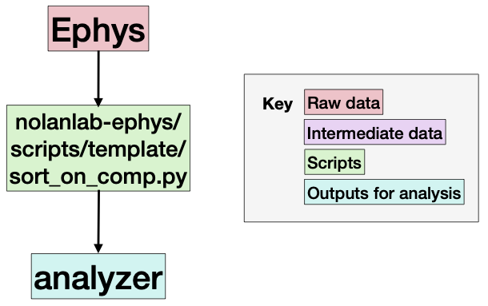

# Nolanlab Ephys

This is the main repo for processing ephys data in the Nolan Lab. The pipeline step takes in raw ephys data and outputs a SpikeInterface sorting analyzer:

 

It will take in raw ephys recordings

```
data_folder/
    global_session_type/
        M{mouse:02d}_D{day:02d}_*_{session_type}/
            Record Node 109/         <---- (or whatever openephys spits out)
```

And output `SortingAnalyzer`s with the naming convention:

```
deriv_folder/
    M{mouse:02d}/
        D{day:02d}/
            probe_layout.pdf
            {session_type}/
                {protocol}/
                    sub-{mouse:02d}_day-{day:02d}_ses-{session}_srt-{protocol}_analyzer
```

Read about the entire NolanLab pipeline: https://github.com/MattNolanLab/analysis_pipelines

## Code organisation

We use a source/scripts workflow. Source code (in the `src/nolanlab-ephys` folder) is meant to be fairly stable. Think hard before you modify it: it's designed to work with all the experiments in the lab. Scripts (in `scripts/{experimenters_name}`) are for bespoke, custom, individual code. You can make many scripts to do many things, or try out new ideas. 

This repo represents a _minimum viable product_: it contains a working spike sorting pipeline. But it has been forked and modified when applied to other projects in the lab. The modified repos can be found here:

- https://github.com/chrishalcrow/nolanlab-ephys (Code which sorts Harry, Bri, Wolf, Junji and Teris' data can be found in scripts/{experimenter_name})

Note that the modifications are contained to the scripts folder. The source folder is identical to the source folder here.

## Use on your own computer

We recommend that you make a fork (your own personal copy) of this repo by clicking `Fork -> Create new fork` above. To begin using the fork on your computer, please download (clone) the repo from github. Then enter the directory and start using the codebase!

```
git clone https://github.com/your_GitHub_username/nolanlab-ephys
cd nolanlab-ephys
```

Then you can run anything you'd like using [`uv`](https://docs.astral.sh/uv/getting-started/installation/) e.g.

```
uv run scripts/template/sort_on_comp.py 25 25 VR kilosort4 --data_folder /path/to/data/folder --deriv_folder /path/to/deriv/folder
```

Read more about the `sort_on_comp.py` script by opening the file: there's lots of documentation inside.

The different spike sorting protocols can be found in `src/nolanlab_ephys/si_protocols.py`.

You can visualise the results using e.g.

```
uv run scripts/template/visualise_results.py 25 25 VR kilosort4 --deriv_folder /path/to/deriv/folder
```

## Using on EDDIE

The package is designed to be used on the Nolan Lab's data on your local computer or on EDDIE, the Edinburgh supercomputer. To run a spike sorting pipeline on Eddie, do the following. First, log on to EDDIE and get a login node:

``` bash
ssh edinburgh_username@eddie.ecdf.ed.ac.uk
... wait to get on to eddie ...
qlogin -l h_vmem=8G
```

We'll now install this package. EDDIE has a 2TB scratch you can use to put stuff in. We'll navigate to there (then into wherever you want to store this code. I've made a `my_project/code` folder), download ("clone") this package, then navigate into the package:

``` bash
cd /exports/eddie/scratch/chalcrow/my_project/code
git clone https://github.com/MattNolanLab/nolanlab-ephys.git
cd nolanlab-ephys
```

Now you can run some scripts! Each script is kept in `scripts/experimenter_name/blah.py`. Each step of each experimenters pipeline bespoke script. For it to run, it needs to know some info. For spike sorting it needs to know the: mouse, day, sessions, sorting protocol, folder to put the data on the scratch, folder to put the derivatives on the scratch. Here's an example on my login (note: you need to change chalcrow to something else):

``` bash
uv run scripts/template/sort_on_eddie.py 25 20 OF1,VR,OF2 kilosort4A --data_folder /exports/eddie/scratch/chalcrow/wolf/data/ --deriv_folder /exports/eddie/scratch/chalcrow/wolf/derivatives
```
